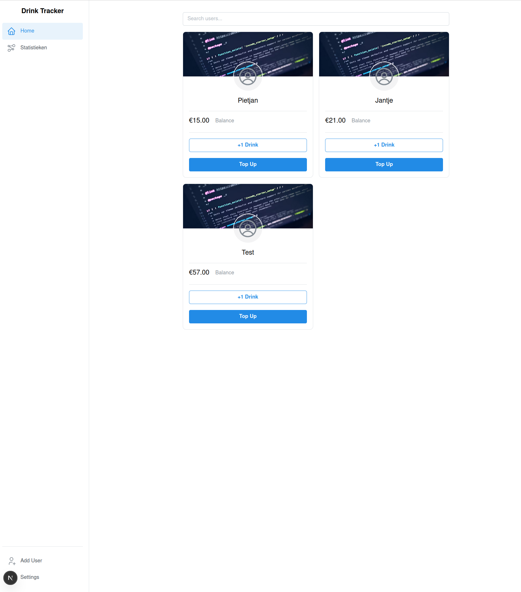

<a name="top"></a>
<h1 align="center">🥤 DrinkTracker</h1>

<p align="center">
  A simple and professional drink balance tracker for teams.<br/>
  Track drink consumption, manage balances, and view insightful statistics.<br/>
  <a href="https://github.com/Pecako2001/DrinkTracker">GitHub Repository</a>
</p>

---

## 📑 Table of Contents

- [Features](#features)
- [UI Preview](#ui-preview)
- [Tech Stack](#tech-stack)
- [Getting Started](#getting-started)
- [Admin Access](#admin-access)
- [Database Backup](#database-backup)

---

## 🚀 Features

- **User Cards:** Easily add drinks or top up a user’s balance with one click.
- **Undo Actions:** Added a drink by mistake? Instantly undo it.
- **Admin Panel:** Password-protected access to manage users, update balances, and view payment history.
- **Statistics Page:** Clean dashboards for monthly/yearly drink stats and user leaderboards.
- **Responsive Design:** Optimized for desktop and mobile use.

<p align="right">(<a href="#top">Back to top</a>)</p>

## 📸 UI Preview

<p align="center">
  
</p>

<p align="right">(<a href="#top">Back to top</a>)</p>

## 📦 Tech Stack

<table>
  <tr>
    <td><b>Frontend</b></td>
    <td>React, Next.js, Mantine UI, Tabler Icons</td>
  </tr>
  <tr>
    <td><b>Backend</b></td>
    <td>FastAPI (Python), SQLAlchemy, PostgreSQL</td>
  </tr>
  <tr>
    <td><b>Other</b></td>
    <td>Docker, REST API, Pydantic</td>
  </tr>
</table>

<p align="right">(<a href="#top">Back to top</a>)</p>

## 🔧 Getting Started

```bash
# Install backend dependencies
cd backend
pip install -r requirements.txt

# Start the backend (FastAPI)
uvicorn app.main:app --reload

# Install frontend dependencies
cd ../frontend
npm install

# Start the frontend
npm run dev
```

<p align="right">(<a href="#top">Back to top</a>)</p>

## 🔐 Admin Access

To access the admin panel, enter the password defined in your `.env.local`:

```env
NEXT_PUBLIC_ADMIN_PASSWORD=your_secure_password
```
Replace `your_secure_password` with a strong secret.

<p align="right">(<a href="#top">Back to top</a>)</p>

## 🗄 Database Backup

A helper script `scripts/backup_db.sh` is available to dump the PostgreSQL database and upload the archive to Google Drive or OneDrive using [rclone](https://rclone.org). The script keeps only the two most recent backups on the remote storage.

Usage example:

```bash
# Configure rclone with a remote named "gdrive" or "onedrive"
./scripts/backup_db.sh gdrive DrinkTrackerBackups
```

To run the backup every day at 2 AM via cron:

```cron
0 2 * * * /path/to/DrinkTracker/scripts/backup_db.sh gdrive DrinkTrackerBackups
```

You can automate the setup using `scripts/install_backup_cron.sh`, which creates a daily cron entry. The following command installs a job that runs at 2 AM every day:

```bash
./scripts/install_backup_cron.sh gdrive DrinkTrackerBackups 2
```

<p align="right">(<a href="#top">Back to top</a>)</p>
